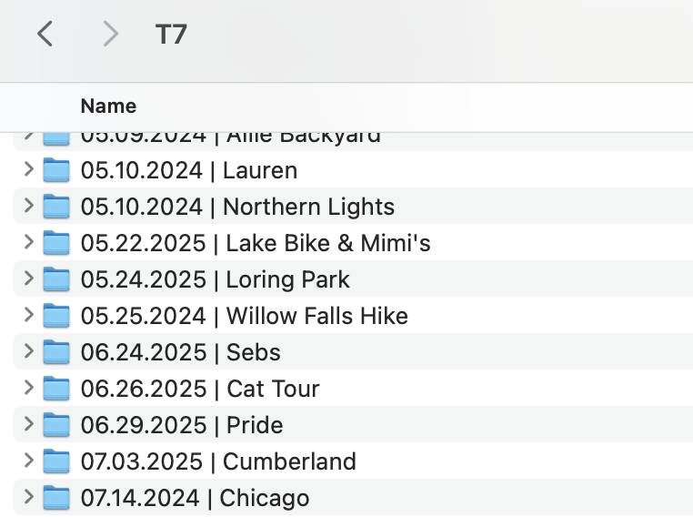
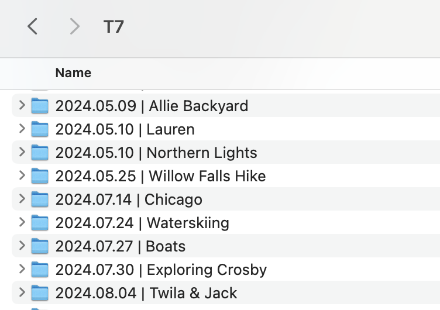

# reformat-date-script

One of my biggest hobbies is photography, and after starting to take raw photos on a dedicated camera, I quickly found out that the photos were too large to be kept in my phone's iCloud storage. I got an external SSD to store all my pictures, and I had organized all my photos by keeping them in folders by the date they were taken and a few-word description, using the format **"MM.DD.YYYY | Description"**. This worked great for me in 2024, keeping all my photos neatly in order. However, in 2025, I came to the realization that when sorting by name, because it started with the month instead of the year, the folders lost their chronological order and ended up looking messy. 

Example of drive before sorting:

I realized quickly I should have done **"YYYY-MM-DD | Description"** instead, but the idea of going through these folders one by one to rename them all to move them sounded terrible. Then I realized I could use Python! I wrote a very simple script to fix the issue, placed it in the SSD directory, and ran the program – all done!

Example of drive after sorting:

This project was super super simple, but I was excited to create something that helped me automate a tedious and boring task :)